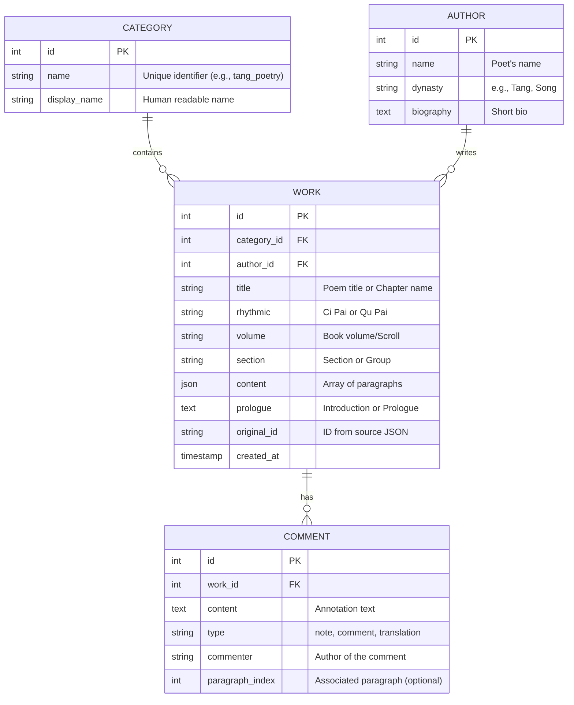

# Chinese Poetry Database Design

This document outlines the database schema designed to support the Chinese Poetry backend service. It unifies data from various sources (Tang Poetry, Song Ci, Classics, etc.) into a structured relational format.

## 1. Overview

The database is designed to handle:
- **Diverse Formats**: Standard poems (Shi), Lyrics (Ci), Songs (Qu), and Classical texts (Jing/Essays).
- **Rich Metadata**: Authors, dynasties, rhythmic patterns (Ci Pai), and detailed annotations.
- **Hierarchical Content**: Support for books, chapters, and sections.

## 2. ER Diagram



## 3. SQL Schema Definitions

The following SQL statements (PostgreSQL compatible) define the database structure.

### 3.1. Categories Table
Stores the source collection types.

```sql
CREATE TABLE categories (
    id SERIAL PRIMARY KEY,
    name VARCHAR(50) NOT NULL UNIQUE, -- e.g., 'quantangshi', 'songci', 'lunyu'
    display_name VARCHAR(100),        -- e.g., '全唐诗', '宋词', '论语'
    description TEXT
);
```

### 3.2. Authors Table
Stores poet and author information.

```sql
CREATE TABLE authors (
    id SERIAL PRIMARY KEY,
    name VARCHAR(255) NOT NULL,
    dynasty VARCHAR(50),              -- e.g., '唐', '宋', '清', '汉'
    biography TEXT,
    CONSTRAINT uniq_author_dynasty UNIQUE (name, dynasty)
);
```

### 3.3. Works Table
The main table storing the texts. `content` is stored as JSONB for flexibility and to preserve line structure.

```sql
CREATE TABLE works (
    id SERIAL PRIMARY KEY,
    category_id INTEGER REFERENCES categories(id),
    author_id INTEGER REFERENCES authors(id),
    
    -- Titles and Classification
    title VARCHAR(255),               -- Main title
    rhythmic VARCHAR(255),            -- 词牌名/曲牌名 (e.g., '菩萨蛮')
    
    -- Hierarchy (mostly for Classics)
    volume VARCHAR(100),              -- 卷 (e.g., '卷一', '国风')
    section VARCHAR(100),             -- 篇/章 (e.g., '周南')
    
    -- Content
    content JSONB NOT NULL,           -- Array of strings: ["line 1", "line 2"]
    prologue TEXT,                    -- Introductions (e.g., in Shuimotangshi)
    
    -- Metadata
    original_id VARCHAR(100),         -- ID from the JSON source file
    created_at TIMESTAMP DEFAULT CURRENT_TIMESTAMP,
    
    -- Index for searching
    CONSTRAINT fk_category FOREIGN KEY (category_id) REFERENCES categories(id),
    CONSTRAINT fk_author FOREIGN KEY (author_id) REFERENCES authors(id)
);

CREATE INDEX idx_works_title ON works(title);
CREATE INDEX idx_works_rhythmic ON works(rhythmic);
```

### 3.4. Comments Table
Stores annotations, translations, and commentaries.

```sql
CREATE TABLE comments (
    id SERIAL PRIMARY KEY,
    work_id INTEGER REFERENCES works(id) ON DELETE CASCADE,
    
    content TEXT NOT NULL,
    type VARCHAR(50) DEFAULT 'note',  -- 'note' (注释), 'comment' (评析), 'translation' (译文)
    commenter VARCHAR(100),           -- e.g., '朱熹', '曹秋岳'
    paragraph_index INTEGER,          -- Optional: Link to specific paragraph index
    
    created_at TIMESTAMP DEFAULT CURRENT_TIMESTAMP
);
```

## 4. Data Mapping Guide

This section explains how to map fields from the source JSON files to the database schema.

### 4.1. Poetry (Tang, Song, Yuan, Caocao, Nalan, Wudai)

| JSON Field | Database Table | Database Column | Notes |
|------------|----------------|-----------------|-------|
| `author`   | `authors`      | `name`          | Deduplicate by name + dynasty |
| `dynasty`  | `authors`      | `dynasty`       | If missing, infer from folder (e.g., Tang) |
| `title`    | `works`        | `title`         | |
| `rhythmic` | `works`        | `rhythmic`      | For Song Ci, Wudai, Yuan Qu |
| `paragraphs`|`works`        | `content`       | Store as JSON array |
| `notes`    | `comments`     | `content`       | `type` = 'note' |
| `id`       | `works`        | `original_id`   | |
| `prologue` | `works`        | `prologue`      | Present in Shuimotangshi |

### 4.2. Classics (Lunyu, Sishuwujing, Mengxue, Shijing)

| JSON Field | Database Table | Database Column | Notes |
|------------|----------------|-----------------|-------|
| `chapter`  | `works`        | `title`         | e.g., "学而篇" as Title |
| `section`  | `works`        | `section`       | e.g., "周南" in Shijing |
| `title`    | `works`        | `title`         | Use Title if present |
| `paragraphs`|`works`        | `content`       | Store as JSON array |
| `content`  | `works`        | `content`       | Some files use `content` instead of `paragraphs` |

### 4.3. Essays / Aphorisms (Youmengying)

| JSON Field | Database Table | Database Column | Notes |
|------------|----------------|-----------------|-------|
| `content`  | `works`        | `content`       | Wrap single string in array: `[content]` |
| `comment`  | `comments`     | `content`       | Array of strings. Parse "Name: Comment" if possible to extract `commenter`. |
| `(none)`   | `works`        | `title`         | Generate snippet or leave NULL |

## 5. Source Specifics

| Source | Category Name | Dynasty | Special Handling |
|--------|---------------|---------|------------------|
| 曹操诗集 | `caocao` | 汉/魏 | |
| 楚辞 | `chuci` | - | `section` map to `section`, `title` map to `title` |
| 论语 | `lunyu` | - | `chapter` -> `title` |
| 蒙学 | `mengxue` | - | Multiple files, use filename as `category` subtype or `volume` |
| 纳兰性德 | `nalan` | 清 | |
| 全唐诗 | `quantangshi` | 唐 | Use `id` field |
| 诗经 | `shijing` | - | `chapter` -> `volume`, `section` -> `section` |
| 水墨唐诗 | `shuimotangshi`| 唐 | Has `prologue` |
| 四书五经 | `sishuwujing` | - | `chapter` -> `title` |
| 宋词 | `songci` | 宋 | `rhythmic` is key |
| 五代诗词 | `wudai` | 五代 | |
| 幽梦影 | `youmengying` | 清 | Structure is Content + Comments |
| 御定全唐诗| `yuding` | 唐 | Has `biography`, `notes` |
| 元曲 | `yuanqu` | 元 | `dynasty` field exists |

